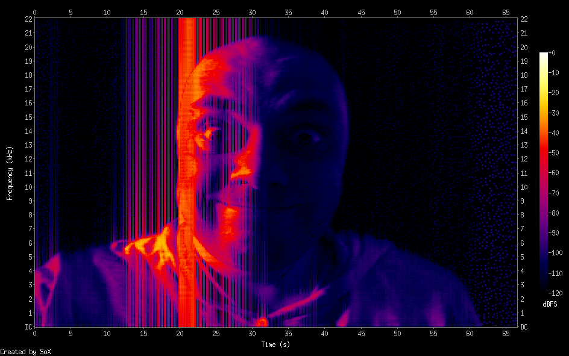

# Convert image into sound

## Depends on:

    cpan Audio::Wav
    cpan GD

### Usage:

    perl imageSpectrogram.pl image_file sound_file.wav

## macOS only: `spectr.rb`. Depends on:

    brew install sox

### Usage:

    ./spectr.rb image_file [--resize]

This will produce sound file via `imageSpectrogram.pl` and it's spectrogram via `sox`.

## Examples:

    ./spectr.rb selfie3.jpg --resize

This command will produce this spectrogram:

